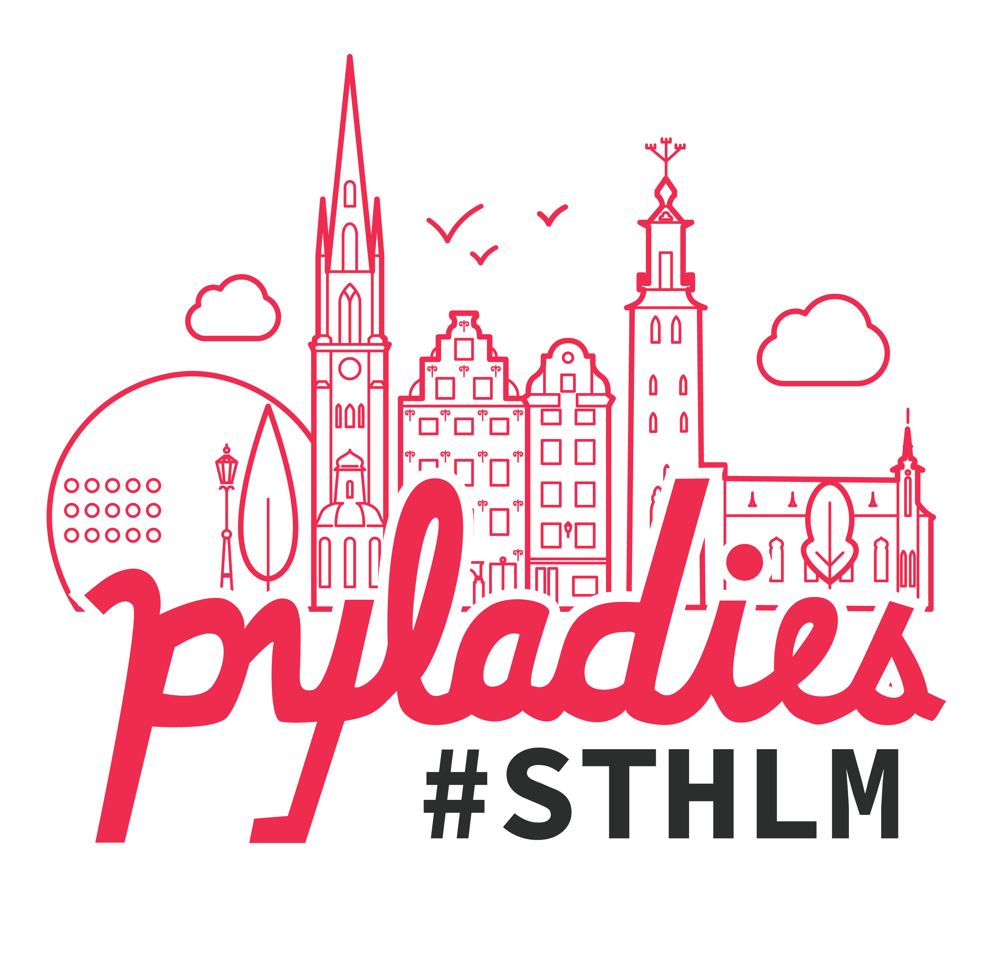

# PyLadies Stockholm site

 
 
 

This is the website of the PyLadies Stockholm chapter hosted on
[Github Pages](https://pyladies.se)

## Tech
The page is created with basic html and styled with [Bulma](https://bulma.io/). There is minimal javascript to help make the [mobile menu](https://bulma.io/documentation/components/navbar/#navbar-menu) work.

To register interest in developing the page further, reach out to the organisers on [Slack](https://slackin.pyladies.com) an the #city-stockholm channel.
## License
The scripts and documentation in this project are released under the [MIT License](LICENSE).
The images are under 